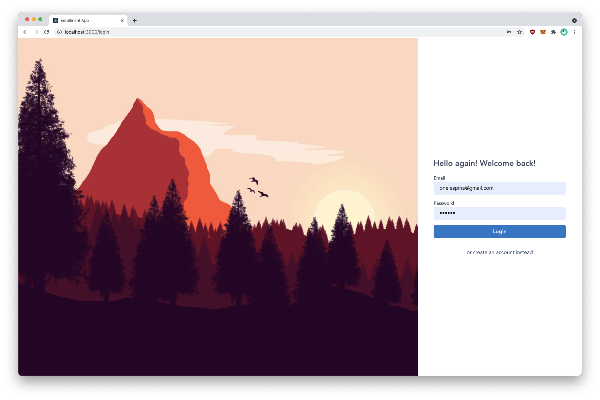
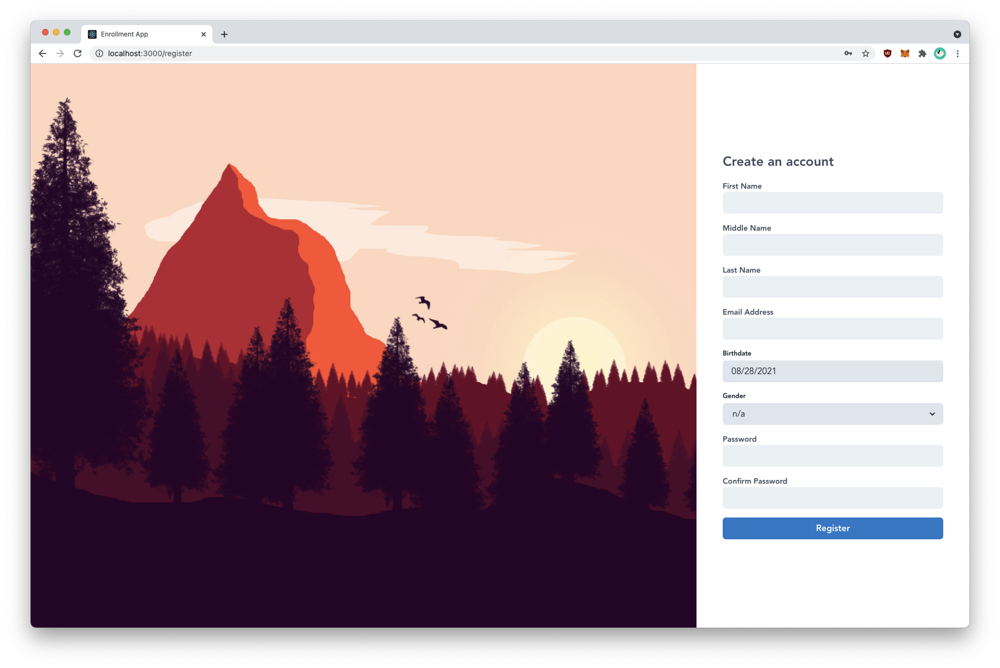
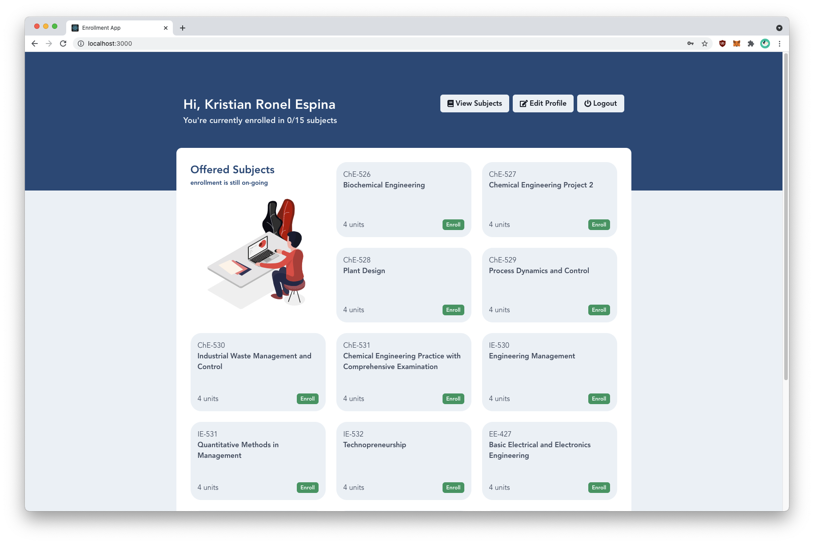
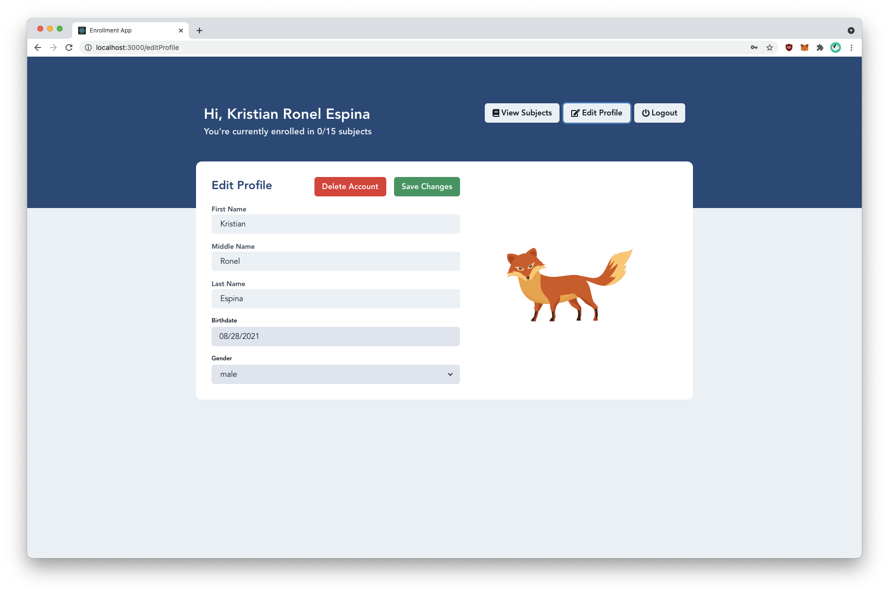

# Enrollment System

A webapp written in ReactJS (with Redux and TypeScript) under Express/SQLite3 backend

## Project Structure

The repository is divided into two parts: the _frontend_ and the _backend_. In production setting, this is **NOT** recommended as we typically create separate repositories for the backend and the frontend. However, for this submission, to keep everything in one place, I've deliberately structured it this way.

### Technologies Used

#### Frontend

- ReactJS
- TypeScript
- ChakraUI
- Redux
- ReduxToolkitJS
- SCSS
- FontAwesome
- Axios
- JWT

#### Backend

- ExpressJS
- TypeScript
- JWT
- Sequelize
- SQLite3

## Preview

### Login Page



### Registration Page



### Courses Page



### Profile Page



## Requirements

- node.js v14.x.x (14.17.5 recommended)
- npm v6.x.x (6.14.14)

## Installation

### 1. Install the dependencies for the backend

```bash
# in root project directory,
cd backend
npm rebuild
npm install
npm start
```

### 2. Install the dependencies for the frontend

```bash
# in root project directory,
cd frontend
npm install
```

## Running the servers

Before running the servers, make sure that the following ports are available: **3000**, and **3001** for the frontend and backend respectively.

### 1. Start the backend (REST server)

```bash
# in ./backend
npm start
```

### 2. Start the frontend web server

```bash
# in ./frontend
npm start
```

### 3. Access the web app

Using the browser, we can now access the tic tac toe web app at this url: `http://localhost:3000`

## Test Accounts

There are a total of 10 test accounts

```json
{
  "email": "student1@gmail.com",
  "password": "123456"
},
{
  "email": "student2@gmail.com",
  "password": "123456"
},
{
  "email": "student3@gmail.com",
  "password": "123456"
},
{
  "email": "student4@gmail.com",
  "password": "123456"
},
{
  "email": "student5@gmail.com",
  "password": "123456"
},
{
  "email": "student6@gmail.com",
  "password": "123456"
},
{
  "email": "student7@gmail.com",
  "password": "123456"
},
{
  "email": "student8@gmail.com",
  "password": "123456"
},
{
  "email": "student9@gmail.com",
  "password": "123456"
},
{
  "email": "student10@gmail.com",
  "password": "123456"
}
```

## Author

Kristian Espina
